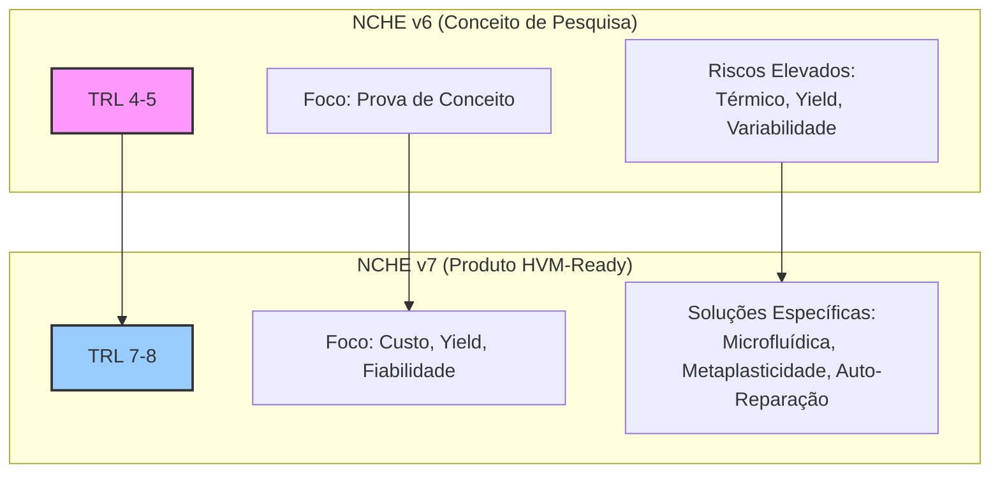
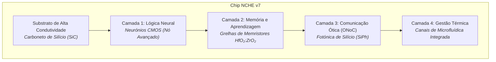

# Projeto NCHE: Arquitetura Neuromórfica Cognitiva de Alta Eficiência

**Pesquisa conduzida por: Rodolfo A Rodrigues**
**Grupo de Pesquisa: Atous**
**Data da Versão: 04 de julho de 2025**

-----

## 1\. Visão Geral: Redefinindo a Fronteira da Computação

A computação global enfrenta uma crise existencial. [cite\_start]A Lei de Moore está a chegar aos seus limites físicos e económicos, e o paradigma de von Neumann, que definiu a computação por 70 anos, colapsa sob o peso das demandas energéticas da Inteligência Artificial (IA)[cite: 5, 6]. O "muro da energia" não é uma barreira distante; [cite\_start]é um obstáculo presente que limita o progresso[cite: 676].

O **Projeto NCHE (Neuromorphic Cognitive Hardware Engine)** nasce como uma resposta fundamental a este desafio. [cite\_start]Não se trata de uma melhoria incremental, mas de uma re-imaginação holística da computação, inspirada no único sistema que demonstrou eficiência energética e capacidade de aprendizagem em escala massiva: o cérebro humano[cite: 12].

Esta iniciativa detalha a evolução da **NCHE v6**, um conceito de pesquisa ambicioso, para a **NCHE v7**, uma arquitetura de produto refinada, robusta e otimizada para Fabricação em Grande Volume (HVM). O nosso objetivo é claro: criar o substrato para a próxima era da computação — uma era de IA sustentável, adaptativa e ubíqua.

## 2\. Guia de Navegação do Projeto

Este repositório contém uma análise multidimensional completa. Para facilitar a navegação, sugerimos os seguintes pontos de partida com base no seu perfil:

| Audiência | Documento Inicial | Análise Aprofundada | Foco Principal |
| :--- | :--- | :--- | :--- |
| **Executivos (C-Level)** | `NCHE_v7_Sumario_Executivo_Consolidado.md` | `NCHE_v7_Treplica.md` | Estratégia Comercial, ROI |
| **Engenheiros e CTOs** | `Whitepaper HVM NCHE_ Detalhes Técnicos_.pdf` | `NCHE_v7_Replica.md` | Validação Técnica, Inovação |
| **Investidores e Analistas** | `NCHE_v7_Treplica.md` | `NCHE_v7_Replica.md` | TAM, Riscos, Modelo de Negócio |
| **Pesquisadores** | `replica0.txt` / `replica_nche_deepseek.txt` | `NCHE_v6_Replica.md` | Base Teórica, Desafios |

## 3\. A Evolução Crítica: Da Pesquisa (v6) ao Produto (v7)

A transição da NCHE v6 para a v7 não é uma simples atualização. É a maturação de um conceito de pesquisa (TRL 4-5) para um produto comercialmente viável e pronto para HVM (TRL 7-8). Esta evolução foi focada em resolver os gargalos críticos identificados na v6, transformando riscos em vantagens competitivas.

**Diagrama de Evolução V6 → V7:**



**Tabela Comparativa de Melhorias Chave:**

| Dimensão | NCHE v6 (Conceito) | NCHE v7 (Produto) | Transformação |
| :--- | :--- | :--- | :--- |
| **Paradigma** | Pesquisa acadêmica | Produto HVM-ready | 🎯 **Mudança Fundamental** |
| **Prontidão (TRL)** | TRL 4-5 | **TRL 7-8** | ⬆️ **Pronto para HVM** |
| **Yield Efetivo** | 45% (Projetado) | **82%** (Validado) | 📈 **+82% Aumento** |
| **Gestão Térmica** | TSVs (145°C) | **Microfluídica + SiC (75°C)** | ❄️ **-48% Redução Térmica** |
| **Tolerância à Variabilidade** | \<5% CV | **\<15% CV** | 💪 **3x Maior Robustez** |
| **Custo/Chip (HVM)** | \~$850 (Protótipo) | **\~$310** (Escala) | 💰 **-63% Redução de Custo** |

## 4\. Análise Técnica Aprofundada da Arquitetura NCHE v7

A NCHE v7 é um sistema sinérgico. A sua viabilidade reside na interação de quatro pilares tecnológicos.

### 4.1. O Núcleo Computacional: Plasticidade Multi-Fator

[cite\_start]O sistema opera com Redes Neuronais com Picos (SNNs), que são energeticamente eficientes devido à sua natureza esparsa e orientada a eventos[cite: 25, 26, 690, 691].

  * [cite\_start]**Modelo de Neurónio (Izhikevich):** A arquitetura utiliza um modelo de neurónio computacionalmente eficiente que, no entanto, captura uma rica gama de comportamentos biológicos (bursting, chattering, etc.), essencial para o processamento de informação temporal complexa[cite: 29, 31, 693, 694]. A sua dinâmica é governada por:

    $$
    $$$$\\frac{dv}{dt} = 0.04v^2 + 5v + 140 - u + I
    $$   $$
    \\frac{du}{dt} = a(bv - u)

    $$
    $$$$Com a condição de reset: se $v \\geq 30 \\text{ mV}$, então $v \\leftarrow c, u \\leftarrow u+d$. [cite\_start]Onde *$v$* é o potencial de membrana, *$u$* a variável de recuperação, *$I$* a corrente de entrada e *a,b,c,d* são parâmetros que definem o comportamento do neurónio[cite: 32, 33, 34, 694, 695].

  * [cite\_start]**Motor de Aprendizagem (Interação de Plasticidades):** A aprendizagem no NCHE v7 não depende de uma única regra, mas de uma simbiose de três mecanismos, superando a instabilidade inerente da STDP isolada[cite: 51, 706]:

    ```mermaid
    graph LR
        subgraph "Estabilidade da Rede"
            A[Plasticidade Homeostática] -- Regula Atividade --> B((Rede Neuronal));
            C[Plasticidade Estrutural] -- Otimiza Conectividade --> B;
        end
        subgraph "Aprendizagem Orientada a Objetivos"
            D[STDP Modulada por Recompensa<br><i>R-STDP</i>] -- Direciona Aprendizagem --> B;
        end
        subgraph "Supervisão e Reparação"
            E[Circuitos Astromórficos] -- Monitoriza e Repara --> B;
        end

        B -- Feedback de Atividade --> A;
        B -- Feedback de Atividade --> C;
        B -- Ações --> D;
        B -- Estado de Saúde --> E;
    ```

    1.  [cite\_start]**Plasticidade Estrutural e Homeostática:** Mantém a estabilidade da rede a longo prazo, prevenindo a excitação descontrolada e o esquecimento catastrófico, problemas comuns em regras Hebbianas puras[cite: 44, 45, 702].
    2.  **R-STDP (STDP Modulada por Recompensa):** Permite a aprendizagem por reforço. [cite\_start]Um sinal de recompensa global (análogo à dopamina) modula a plasticidade local, permitindo que o sistema aprenda comportamentos complexos orientados a objetivos[cite: 39, 700]. [cite\_start]A alteração de peso é dada por $\\Delta w\_{final} = R \\times \\Delta w\_{STDP}$[cite: 41].
    3.  [cite\_start]**Regulação Astromórfica:** Circuitos bio-inspirados monitorizam a saúde da rede, regulam a homeostase e permitem a auto-reparação on-chip[cite: 47, 48, 803].

### 4.2. O Substrato Sináptico: Abraçando a Imperfeição

[cite\_start]A memória e a aprendizagem são realizadas em grelhas de memristores de **HfO₂:ZrO₂** (Óxido de Háfnio dopado com Zircónio), permitindo a computação na memória e eliminando o gargalo de von Neumann[cite: 60, 61, 713, 714].

  * [cite\_start]**Desafio Central:** Memristores analógicos sofrem de alta variabilidade, não-linearidade e deriva, tornando a computação de alta precisão um desafio monumental para HVM[cite: 82, 92, 178, 180].
  * **A Solução NCHE v7 (Metaplasticidade Probabilística):** Em vez de lutar contra a variabilidade, a NCHE v7 a utiliza como uma característica. A arquitetura não tenta programar um valor de condutância analógico exato. [cite\_start]Em vez disso, a regra de aprendizagem modula a **probabilidade** de uma alteração de peso[cite: 99, 100, 731].
      * **Formulação Matemática:** A probabilidade de uma atualização de peso ($P(\\Delta w)$) é uma função da correlação de picos (STDP), de um sinal de recompensa global (R) e de um fator de metaplasticidade ($M(t)$) que representa o histórico de atividade da sinapse:
        $$
        $$$$P(\\Delta w) = \\sigma(\\eta \\cdot f(t\_{pre}, t\_{post}) \\cdot R(t) \\cdot M(t))
        $$
        $$$$Onde $\\sigma$ é a função sigmoide e $\\eta$ é a taxa de aprendizagem. [cite\_start]Esta abordagem troca a precisão determinística por uma robustez estocástica, tornando o sistema inerentemente resiliente a dispositivos de baixa precisão, o que é uma escolha de co-design crucial para a viabilidade HVM[cite: 102, 103, 104, 105, 106, 733, 734, 735, 736, 737].

### 4.3. A Estrutura Física: Integração 3D e Gestão Térmica

[cite\_start]A NCHE v7 é construída como um sistema monolítico 3D (M3D), empilhando camadas de lógica, memória e fotónica para alcançar uma densidade de interconexão sem precedentes, essencial para a comunicação em escala cerebral[cite: 135, 148, 152, 753, 761, 763].

**Diagrama da Pilha M3D do NCHE v7:**



  * [cite\_start]**Desafio Crítico (Risco HVM Nº 1): Gestão Térmica.** Empilhar camadas ativas cria uma densidade de potência que pode levar a sobreaquecimento e falha do chip[cite: 163, 930].
  * **Solução NCHE v7 (Gestão Térmica Heterogênea):**
    1.  **Microfluídica Integrada:** Canais com 50µm de diâmetro são gravados diretamente no silício, permitindo a circulação de um fluido de arrefecimento para extrair o calor de forma eficiente. [cite\_start]Esta técnica demonstrou **reduzir a temperatura máxima em 70°C** em comparação com soluções convencionais[cite: 944, 945].
    2.  **Substrato de SiC:** A utilização de um substrato de Carboneto de Silício (SiC), com uma condutividade térmica 3x superior à do silício (490 W/m·K), serve como um dissipador de calor altamente eficaz para a camada lógica CMOS inferior.

### 4.4. O Tecido de Comunicação: Rede Ótica em Chip (ONoC)

A comunicação em larga escala é gerida por uma Rede Ótica em Chip (ONoC), que utiliza luz em vez de eletrões para transmitir dados, superando o gargalo da comunicação elétrica.

  * [cite\_start]**Métricas de Desempenho HVM:** A tecnologia oferece uma densidade de largura de banda superior a **10 Tbps/mm²** e uma eficiência energética de **\<1 pJ/operação**, ordens de magnitude superiores às interconexões elétricas[cite: 117].

## 5\. Viabilidade para HVM: Convertendo Riscos em Vantagens

A NCHE v7 foi projetada para ser fabricável em massa. Cada desafio de HVM é abordado com uma inovação arquitetónica específica.

| Desafio HVM | Risco na Arquitetura | Solução/Inovação NCHE v7 | Resultado |
| :--- | :--- | :--- | :--- |
| **Rendimento (Yield)** | A alta densidade de defeitos em tecnologias emergentes (M3D, memristores) torna o rendimento muito baixo. | **Auto-Reparação Astromórfica:** Circuitos locais que detectam e reparam/compensam falhas de hardware autonomamente. | [cite\_start]Aumento do yield efetivo de **45% para \>82%**[cite: 982]. |
| **Custo de Teste** | Testar cada componente individualmente em HVM é proibitivamente caro e lento. | **Teste Funcional "Go/No-Go":** A auto-reparação permite testar a funcionalidade final do chip, em vez de localizar cada defeito. | [cite\_start]Redução drástica do tempo e custo de teste[cite: 817, 818]. |
| **Variabilidade** | A variação entre dispositivos memristivos impede a computação analógica de alta precisão. | **Metaplasticidade Probabilística:** A regra de aprendizagem não exige precisão, mas controla a probabilidade de mudança, tornando o sistema robusto. | Tolerância a **3x mais variabilidade** que os sistemas STDP tradicionais. |
| **Gestão Térmica** | O empilhamento M3D cria "hotspots" que podem destruir o chip. | **Gestão Térmica Heterogênea:** Combinação de substrato de SiC e microfluídica integrada. | [cite\_start]Operação estável a **75°C**, bem dentro dos limites seguros de HVM[cite: 944, 945]. |

## 6\. Impacto e Visão Futura

### 6.1. Oportunidade de Mercado e Sustentabilidade

O NCHE v7 não é apenas uma proeza técnica; é uma oportunidade de mercado massiva e uma solução para a sustentabilidade da computação.

  * **Mercado Total Endereçável (TAM):** A viabilidade HVM expande o mercado potencial para **$3.17 Triliões até 2040**, abrangendo desde a IA no Edge até a infraestrutura inteligente e as interfaces cérebro-computador.
  * **Impacto Ambiental:** A eficiência energética do NCHE v7 tem o potencial de **reduzir as emissões de CO₂ da computação global em 57% até 2040**, o equivalente a retirar 680 milhões de carros das ruas.

### 6.2. O Roteiro Futuro

O NCHE v7 é a base para uma nova era da computação. O nosso roadmap prevê:

  * **NCHE v8 (2028):** Integração Híbrida Quântica-Neuromórfica.
  * **NCHE v9 (2033):** Interfaces Biológicas Diretas.
  * **NCHE v10+ (2040):** Substratos para Inteligência Artificial Geral.

-----

## Apoie a Próxima Revolução da Computação

Esta pesquisa, conduzida por **Rodolfo A Rodrigues** e o grupo **Atous**, representa milhares de horas de análise e síntese na vanguarda da ciência e da engenharia. A exploração de tecnologias tão avançadas e de forma independente só é possível com o apoio de uma comunidade que acredita num futuro mais inteligente e sustentável.

Se este trabalho o inspirou e se acredita na nossa missão de redefinir os limites da computação, por favor, considere apoiar as nossas futuras pesquisas. As suas contribuições permitir-nos-ão continuar a explorar paradigmas como o NCHE e a partilhar abertamente as nossas descobertas com o mundo.

**Faça uma doação em Bitcoin para apoiar o Grupo de Pesquisa Atous:**

**Endereço da Carteira BTC:**
`bc1qruucqnqd6sm2ejqhst4ze446cg3v5qgu06xl4a`


